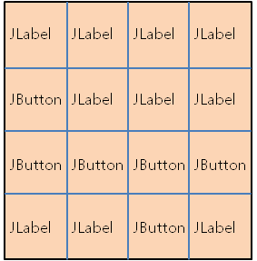

# Java GUI

## 목차  
1. <a href="#1-GUI-프로그래밍-개요">GUI 프로그래밍 개요</a>
2. <a href="#2-GUI-JFrame-크기-위치-및-좌표계">GUI JFrame 크기, 위치 및 좌표계</a>
3. <a href="#3-JLabel-사용하기">JLabel 사용하기</a>
4. <a href="#4-Font-클래스">Font 클래스</a>
4. <a href="#5-Color-클래스">Color 클래스</a>
4. <a href="#6-GridLayout">GridLayout</a>
4. <a href="#7-JButton">JButton</a>
4. <a href="#8-BorderLayout">BorderLayout</a>
4. <a href="#9-JTextField">JTextField</a>
4. <a href="#10-FlowLayout">FlowLayout</a>
4. <a href="#11-BoxLayout">BoxLayout</a>
4. <a href="#12-JPanel">JPanel</a>
4. <a href="#13-JTable">JTable</a>
4. <a href="#14-Drawing">Drawing</a>

<br><br>

## 1. GUI 프로그래밍 개요
### Hello world 출력
```
JFrame frame = new JFrame(제목);
JLabel label = new JLabel(내용);
frame.add(label);
frame.pack(); // 내용물에 맞게 크기 조절
frame.setVisible(true);
```
### 이클립스 오류: there are no recent launches
1. Window -> Preferences
2. Run/Debug -> Launching
3. Launch Operation -> Launch the associated project

**기존에 '이전에 실행시켰던 어플리케이션 시작'으로 되어있음**

<br><br>

## 2. GUI JFrame 크기, 위치 및 좌표계
### JFrame 위치 지정
```
JFrame.setLocation(int x, int y)
```
### Java 의 좌표계
* 우측으로 갈수록 X 값이 증가
* 하단으로 갈수록 Y 값이 증가

### JFrame 크기 조절
```
new Dimension(int x, int y);
JFrame.setPrefferedSize(Dimension);
```
**크기 조절 이후에 JFrame.pack() 을 해주지 않으면 적용 되지 않음**

<br><br>

## 3. JLabel 사용하기
### JLabel 생성
```
new JLabel(String);
JFrame.add(JLabel);
```

### JLabel Method
```
JLabel.setText(String);
JLabel.getText();
JLabel.setVerticalAlignment(SwingConstants);
JLabel.setHorizontalAlignment(SwingConstants);
JLabel.getVerticalAlignment();
JLabel.getHorizontalAlignment();
```

### 왜 SwingConstants 는 Interface 일까?
정의된 메소드가 따로 없기 때문에 enum 으로 작성하는게 적합하다고 생각했지만 interface 인 이유는 SwingConstants 를 구현하는 클래스가 필요한 경우가 생기는걸까?

<br><br>

## 4. Font 클래스
글자 스타일 지정, 3가지 속성

### 글자 종류
컴퓨터에 있는 폰트들의 이름

### 글자 스타일
* BOLD
* ITALIC
* PLAIN

Font에 포함되어 있음

### 글자 크기

```
new Font(<종류>, Font.<스타일>, <크기>);
JLabel.setFont(font);
```

### Method
```
Font.getSize() // 폰트 크기 정보 가져옴
Font.getName(), Font.getFontName() // 폰트 종류 가져옴
Font.getStyle() // 폰트 스타일 가져옴
Font.isBold(), Font.isItalic(), Font.isPlain() // 각 스타일 여부 가져옴
```

<br><br>

## 5. Color 클래스
색의 정보를 가짐, R, G, B, Alpha (0~255)

```
JLabel.setOpaque(true); // false 면 적용되지 않음
new Color(0x000000); // r, g, b
new Color(r, g, b);
JLabel.setForeground(Color);
JLabel.setBackground(Color);
```

### 투명도

```
new Color(0x55000000, true); // alpha, r, g, b
new Color(255, 0, 0, 200); // r, g, b, alpha
```

### Method
```
Color.getRed(), Color.getGreen(), Color.getBlue(): 각 색 가져옴
Color.getAlpha(): 투명도 가져옴
Color.getRGB(): 색 정보 전부 가져옴
// Integer.toHexString(Color.getRGB());
```

### Static Color
> Color.<색>

<br><br>

# 6. GridLayout
임의의 열과 행에 각종 UI를 **똑같이** 나누어 배치하는 레이아웃



여러개 UI를 add하면 모두 겹쳐서 마지막에 추가한 UI만 보임

```
new GridLayout(<ROW>, <COLUMN>);
JFRame.setLayout(GridLayOut);
```

<br><br>

# 7. JButton

생성
```
new JButton(<value>);
```

Method
```
setText(String)
setFont(Font)
setBackground(Color)
setHorizontalAlignment(SwingConstants)
setVerticalAlignment(SwingConstants)
setToolTipText(String) // 올려두면 뜨는 도움말
```

클릭 이벤트
```
ActionListener 인터페이스에 actionPerformed(ActionEvent) 구현 // 콜백 메소드
JButton.addActionListener(ActionListener)
```

<br><br>

# 8. BorderLayout

<br><br>

# 9. JTextField

<br><br>

# 10. FlowLayout

<br><br>

# 11. BoxLayout

<br><br>

# 12. JPanel

<br><br>

# 13. JTable

<br><br>

# 14. Drawing