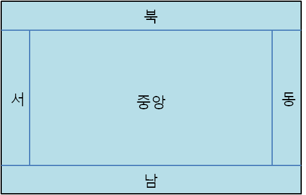

# Java GUI

## 목차  
1. <a href="#1-GUI-프로그래밍-개요">GUI 프로그래밍 개요</a>
2. <a href="#2-GUI-JFrame-크기-위치-및-좌표계">GUI JFrame 크기, 위치 및 좌표계</a>
3. <a href="#3-JLabel-사용하기">JLabel 사용하기</a>
4. <a href="#4-Font-클래스">Font 클래스</a>
4. <a href="#5-Color-클래스">Color 클래스</a>
4. <a href="#6-GridLayout">GridLayout</a>
4. <a href="#7-JButton">JButton</a>
4. <a href="#8-BorderLayout">BorderLayout</a>
4. <a href="#9-JTextField">JTextField</a>
4. <a href="#10-FlowLayout">FlowLayout</a>
4. <a href="#11-BoxLayout">BoxLayout</a>
4. <a href="#12-CardLayout">CardLayout</a>
4. <a href="#13-JPanel">JPanel</a>
4. <a href="#14-JTable">JTable</a>
4. <a href="#15-Drawing">Drawing</a>

<br><br>

## 1. GUI 프로그래밍 개요
### Hello world 출력
```java
JFrame frame = new JFrame(제목);
JLabel label = new JLabel(내용);
frame.add(label);
frame.pack(); // 내용물에 맞게 크기 조절
frame.setVisible(true);
```
### 이클립스 오류: there are no recent launches
1. Window -> Preferences
2. Run/Debug -> Launching
3. Launch Operation -> Launch the associated project

**기존에 '이전에 실행시켰던 어플리케이션 시작'으로 되어있음**

<br><br>

## 2. GUI JFrame 크기, 위치 및 좌표계
### JFrame 위치 지정
```java
JFrame.setLocation(int x, int y)
```
### Java 의 좌표계
* 우측으로 갈수록 X 값이 증가
* 하단으로 갈수록 Y 값이 증가

### JFrame 크기 조절
```java
new Dimension(int x, int y);
JFrame.setPrefferedSize(Dimension);
```
**크기 조절 이후에 JFrame.pack() 을 해주지 않으면 적용 되지 않음**

<br><br>

## 3. JLabel 사용하기
### JLabel 생성
```java
new JLabel(String);
JFrame.add(JLabel);
```

### JLabel Method
```java
JLabel.setText(String);
JLabel.getText();
JLabel.setVerticalAlignment(SwingConstants);
JLabel.setHorizontalAlignment(SwingConstants);
JLabel.getVerticalAlignment();
JLabel.getHorizontalAlignment();
```

### 왜 SwingConstants 는 Interface 일까?
정의된 메소드가 따로 없기 때문에 enum 으로 작성하는게 적합하다고 생각했지만 interface 인 이유는 SwingConstants 를 구현하는 클래스가 필요한 경우가 생기는걸까?

<br><br>

## 4. Font 클래스
글자 스타일 지정, 3가지 속성

### 글자 종류
컴퓨터에 있는 폰트들의 이름

### 글자 스타일
* BOLD
* ITALIC
* PLAIN

Font에 포함되어 있음

### 글자 크기

```java
new Font(<종류>, Font.<스타일>, <크기>);
JLabel.setFont(font);
```

### Method
```java
Font.getSize() // 폰트 크기 정보 가져옴
Font.getName(), Font.getFontName() // 폰트 종류 가져옴
Font.getStyle() // 폰트 스타일 가져옴
Font.isBold(), Font.isItalic(), Font.isPlain() // 각 스타일 여부 가져옴
```

<br><br>

## 5. Color 클래스
색의 정보를 가짐, R, G, B, Alpha (0~255)

```java
JLabel.setOpaque(true); // false 면 적용되지 않음
new Color(0x000000); // r, g, b
new Color(r, g, b);
JLabel.setForeground(Color);
JLabel.setBackground(Color);
```

### 투명도

```java
new Color(0x55000000, true); // alpha, r, g, b
new Color(255, 0, 0, 200); // r, g, b, alpha
```

### Method
```java
Color.getRed(), Color.getGreen(), Color.getBlue(): 각 색 가져옴
Color.getAlpha(): 투명도 가져옴
Color.getRGB(): 색 정보 전부 가져옴
// Integer.toHexString(Color.getRGB());
```

### Static Color
> Color.<색>

<br><br>

# 6. GridLayout
임의의 열과 행에 각종 UI를 **똑같이** 나누어 배치하는 레이아웃


여러개 UI를 add하면 모두 겹쳐서 마지막에 추가한 UI만 보임

```java
new GridLayout(<ROW>, <COLUMN>);
JFrame.setLayout(GridLayOut);
```

<br><br>

# 7. JButton

생성
```java
new JButton(<value>);
```

Method
```java
setText(String)
setFont(Font)
setBackground(Color)
setHorizontalAlignment(SwingConstants)
setVerticalAlignment(SwingConstants)
setToolTipText(String) // 올려두면 뜨는 도움말
```

클릭 이벤트
```java
//ActionListener 인터페이스에 actionPerformed(ActionEvent) 구현
// 콜백 메소드
JButton.addActionListener(ActionListener)
```

<br><br>

# 8. BorderLayout



```java
JFrame.add(<UI>, BorderLayout.<CARDINAL>)
```

<br><br>

# 9. JTextField

```java
new JTextField();
JTextField.setText(String);
JTextField.setEnabled(Boolean);
JTextField.setToolTipText(String);
```

|추상 메소드|호출 시점|
|---|---|
|keyPressed|키를 눌렀을 때 호출됨|
|keyReleased|키를 떼었을 때 호출됨|
|keyTyped|키를 눌렀을 때 호출됨(단, 문자키만)|

```java
new KeyListener() { 구현 }
JTextField.addKeyListener(KeyListener);
```

<br><br>

# 10. FlowLayout
좌측에서 우측으로 각 UI를 배치하다가 길이가 부족하면 줄바꿈하여 배치하는 레이아웃

```java
new FlowLayout();
JFrame.setLayout(layout);
```

<br><br>

# 11. BoxLayout

UI를 일렬로 배치하는 레이아웃

```java
new BoxLayout(ContentPane, BoxLayout.<AXIS>);
JFrame.setLayout(BoxLayout);
```

### ContentPane
JFrame 에서 UI들을 배치하거나 관리하는 클래스

<br><br>

# 12. CardLayout

```java
CardLayout layout = new CardLayout();
frame.setLayout(layout);

Panel panel = new Panel();
panel.setBackground(Color.BLUE);
frame.add(panel);

layout.next(frame.getContentPane());
```

|메소드 또는 생성자|설명|
|---|---|
|CardLayout(int hgap, int vgap)|hgap – 컨테이너와 CardLayout 사이에 간격을 준다.(수평) vgap – 컨테이너와 CardLayout 사이에 간격을 준다.(수직)|
|CardLayout()|컨테이너와 간격이 없는 CardLayout을 생성한다.|
|add(Container parent, String name)|name – 주어진 이름으로, parent – 지정된 컨테이너에 추가한다.|
|show(Container parent, String name)|주어진 이름의 컴포넌트를 컨테이너에 보여준다. name – 나타낼 컨테이너의 이름(추가할 때 사용한 이름) parent – 컴포넌트가 보여질 컨테이너|
|first(Container parent)|parent – 지정된 컨테이너에 첫번째로 추가된 컴포넌트를 보여준다.|
|last(Container parent)|parent – 지정된 컨테이너에 마지막으로 추가된 컴포넌트를 보여준다.|
|previous(Container parent)|지정된 컨테이너에 현재 보여지고 있는 컴포넌트보다 이전에 추가된 것을 보여준다.(현재 보여지고 있는 것이 첫번째 것이면, 제일 마지막 것이 나타나게 된다.)|
|next(Container parent)|지정된 컨테이너에 현재 보여지고 있는 컴포넌트보다 다음에 추가된 것을 보여준다.(현재 보여지고 있는 것이 마지막 것이면, 제일 첫번째 것이 나타나게 된다.)|

### MouseListener
```java
new MouseAdapter()
{
    public void mouseClicked(MouseEvent e)
    {
        // Code
    }
};

Panel.addMouseListener();
```

<br><br>

# 13. JPanel


<br><br>

# 14. JTable

<br><br>

# 15. Drawing